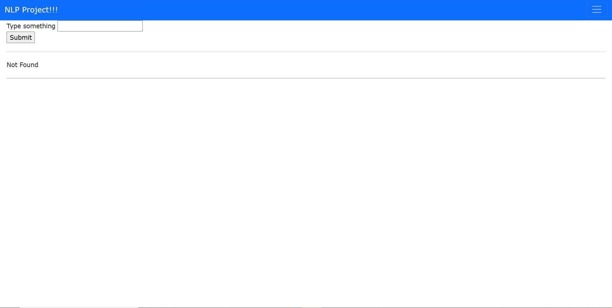
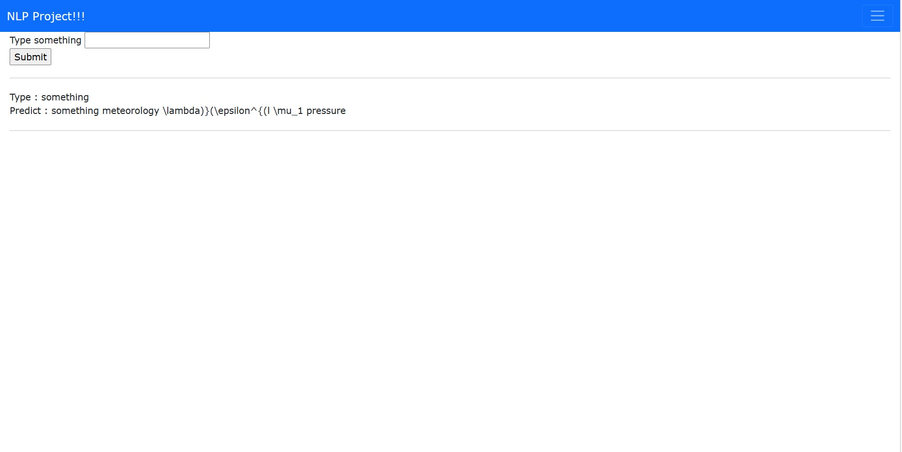

This is demo website for code auto completion (will be improved in the futures with javascript).

Here is what website looks like and it's functionality.

It still failed to predict horribly as I did trained it with just 100,000 sentences of data.

