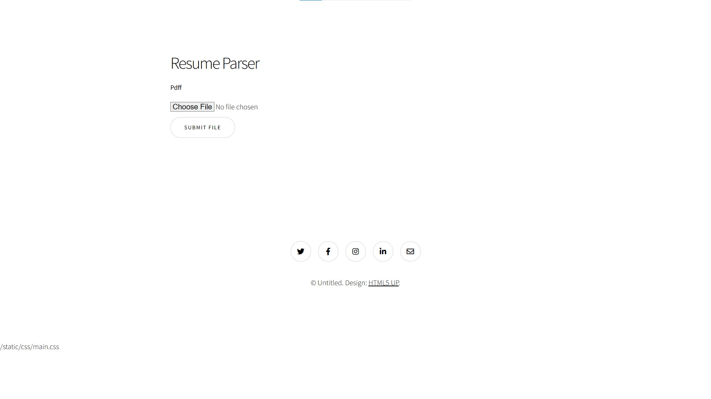
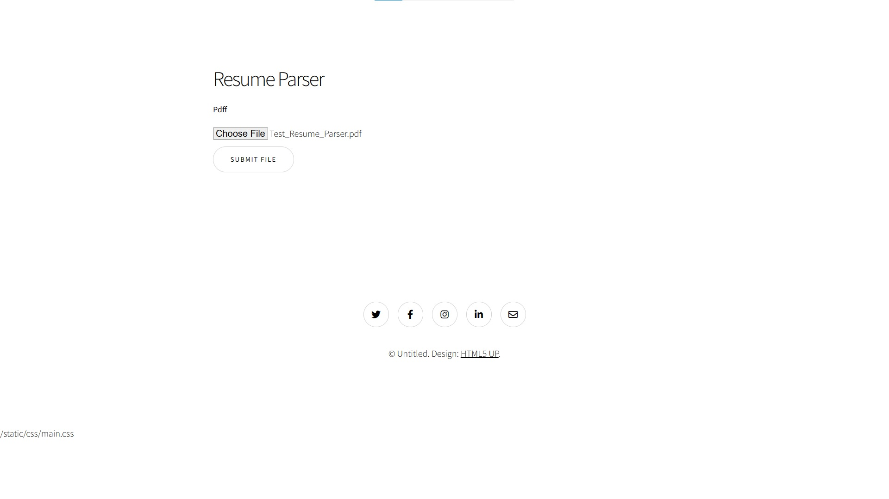

Here is the look is the website for resume parsing.

For the one who download you need to create empty folder named "instance" in the same directory as main.py

then use your terminal to run this command
"export FLASK_APP=main"
"flask run"

For the actual model you can see it inside "data_extrator.py" it's come with a commented!
The 01_Resume_Parser is for models and function testing.

This is homepage.

You can click the button for uploading.

Here is the results.

