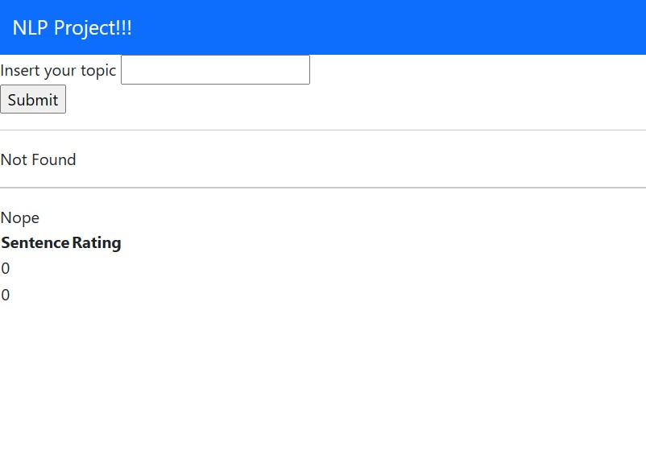
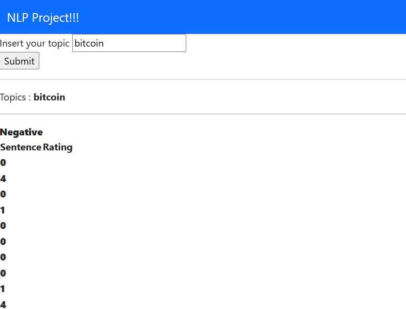

It's not beautiful, the model is bad but it works so it's okay.

You can insert the topic that you're interested e.g. bitcoin.

Then the backend will try to retrieve the information from reddit according to the word that you put in.

And you will now if the word that you put in is positive or negative.
